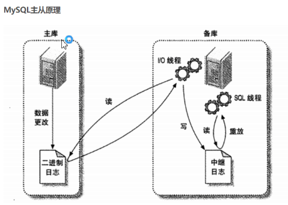

## MySQL性能优化

### 使用索引

在前面[《关系型数据库MySQL》](../Day36-40/36-38.关系型数据库MySQL.md)一文中，我们已经讲到过索引的相关知识，这里我们做一个简单的回顾。

#### 索引的设计原则

1. 创建索引的列并不一定是`select`操作中要查询的列，最适合做索引的列是出现在`where`子句中经常用作筛选条件或连表子句中作为表连接条件的列。
2. 具有唯一性的列，索引效果好；重复值较多的列，索引效果差。
3. 如果为字符串类型创建索引，最好指定一个前缀长度，创建短索引。短索引可以减少磁盘I/O而且在做比较时性能也更好，更重要的是MySQL底层的高速索引缓存能够缓存更多的键值。
4. 创建一个包含N列的复合索引（多列索引）时，相当于是创建了N个索引，此时应该利用最左前缀进行匹配。
5. 不要过度使用索引。索引并不是越多越好，索引需要占用额外的存储空间而且会影响写操作的性能（插入、删除、更新数据时索引也需要更新）。MySQL在生成执行计划时，要考虑各个索引的使用，这个也是需要耗费时间的。
6. 要注意可能使索引失效的场景，例如：模糊查询使用了前置通配符、使用负向条件进行查询等。

### 使用过程

过程，通常也称之为存储过程，它是事先编译好存储在数据库中的一组SQL的集合。调用存储过程可以简化应用程序开发人员的工作，减少与数据库服务器之间的通信，对于提升数据操作的性能是有帮助的，这些我们在之前的[《关系型数据库MySQL》](../Day36-40/36-38.关系型数据库MySQL.md)一文中已经提到过。

### 数据分区

MySQL支持做数据分区，通过分区可以存储更多的数据、优化查询，获得更大的吞吐量并快速删除过期的数据。关于这个知识点建议大家看看MySQL的[官方文档](https://dev.mysql.com/doc/refman/5.7/en/partitioning-overview.html)。数据分区有以下几种类型：

1. RANGE分区：基于连续区间范围，把数据分配到不同的分区。

   ```SQL
   CREATE TABLE tb_emp (
       eno INT NOT NULL,
       ename VARCHAR(20) NOT NULL,
       job VARCHAR(10) NOT NULL,
       hiredate DATE NOT NULL,
       dno INT NOT NULL
   )
   PARTITION BY RANGE( YEAR(hiredate) ) (
       PARTITION p0 VALUES LESS THAN (1960),
       PARTITION p1 VALUES LESS THAN (1970),
       PARTITION p2 VALUES LESS THAN (1980),
       PARTITION p3 VALUES LESS THAN (1990),
       PARTITION p4 VALUES LESS THAN MAXVALUE
   );
   ```

2. LIST分区：基于枚举值的范围，把数据分配到不同的分区。

3. HASH分区 / KEY分区：基于分区个数，把数据分配到不同的分区。

   ```SQL
   CREATE TABLE tb_emp (
       eno INT NOT NULL,
       ename VARCHAR(20) NOT NULL,
       job VARCHAR(10) NOT NULL,
       hiredate DATE NOT NULL,
       dno INT NOT NULL
   )
   PARTITION BY HASH(dno)
   PARTITIONS 4;
   ```

### SQL优化

1. 定位低效率的SQL语句 - 慢查询日志。

   - 查看慢查询日志相关配置

      ```SQL
      mysql> show variables like 'slow_query%';
      +---------------------------+----------------------------------+
      | Variable_name             | Value                            |
      +---------------------------+----------------------------------+
      | slow_query_log            | OFF                              |
      | slow_query_log_file       | /mysql/data/localhost-slow.log   |
      +---------------------------+----------------------------------+

      mysql> show variables like 'long_query_time';
      +-----------------+-----------+
      | Variable_name   | Value     |
      +-----------------+-----------+
      | long_query_time | 10.000000 |
      +-----------------+-----------+
      ```

   - 修改全局慢查询日志配置。

      ```SQL
      mysql> set global slow_query_log='ON'; 
      mysql> set global long_query_time=1;
      ```

      或者直接修改MySQL配置文件启用慢查询日志。

      ```INI
      [mysqld]
      slow_query_log=ON
      slow_query_log_file=/usr/local/mysql/data/slow.log
      long_query_time=1
      ```

2. 通过`explain`了解SQL的执行计划。例如：

   ```SQL
   explain select ename, job, sal from tb_emp where dno=20\G
   *************************** 1. row ***************************
              id: 1
     select_type: SIMPLE
           table: tb_emp
            type: ref
   possible_keys: fk_emp_dno
             key: fk_emp_dno
         key_len: 5
             ref: const
            rows: 7
           Extra: NULL
   1 row in set (0.00 sec)
   ```

   - `select_type`：查询类型（SIMPLE - 简单查询、PRIMARY - 主查询、UNION - 并集、SUBQUERY - 子查询）。
   - `table`：输出结果集的表。
   - `type`：访问类型（ALL - 全表查询性能最差、index、range、ref、eq_ref、const、NULL）。
   - `possible_keys`：查询时可能用到的索引。
   - `key`：实际使用的索引。
   - `key_len`：索引字段的长度。
   - `rows`：扫描的行数，行数越少肯定性能越好。
   - `extra`：额外信息。

3. 通过`show profiles`和`show profile for query`分析SQL。

   MySQL从5.0.37开始支持剖面系统来帮助用户了解SQL执行性能的细节，可以通过下面的方式来查看MySQL是否支持和开启了剖面系统。

   ```SQL
   select @@have_profiling;
   select @@profiling;
   ```

   如果没有开启剖面系统，可以通过下面的SQL来打开它。

   ```SQL
   set profiling=1;
   ```

   接下来就可以通过剖面系统来了解SQL的执行性能，例如：

   ```SQL
   mysql> select count(*) from tb_emp;
   +----------+
   | count(*) |
   +----------+
   |       14 |
   +----------+
   1 row in set (0.00 sec)
   
   mysql> show profiles;
   +----------+------------+-----------------------------+
   | Query_ID | Duration   | Query                       |
   +----------+------------+-----------------------------+
   |        1 | 0.00029600 | select count(*) from tb_emp |
   +----------+------------+-----------------------------+
   1 row in set, 1 warning (0.00 sec)
   
   mysql> show profile for query 1;
   +----------------------+----------+
   | Status               | Duration |
   +----------------------+----------+
   | starting             | 0.000076 |
   | checking permissions | 0.000007 |
   | Opening tables       | 0.000016 |
   | init                 | 0.000013 |
   | System lock          | 0.000007 |
   | optimizing           | 0.000005 |
   | statistics           | 0.000012 |
   | preparing            | 0.000010 |
   | executing            | 0.000003 |
   | Sending data         | 0.000070 |
   | end                  | 0.000012 |
   | query end            | 0.000008 |
   | closing tables       | 0.000012 |
   | freeing items        | 0.000032 |
   | cleaning up          | 0.000013 |
   +----------------------+----------+
   15 rows in set, 1 warning (0.00 sec)
   ```

4. 优化CRUD操作。

   - 优化`insert`语句
     - 在`insert`语句后面跟上多组值进行插入在性能上优于分开`insert`。
     - 如果有多个连接向同一个表插入数据，使用`insert delayed`可以获得更好的性能。
     - 如果要从一个文本文件装载数据到表时，使用`load data infile`比`insert`性能好得多。

   - 优化`order by`语句

     - 如果`where`子句的条件和`order by`子句的条件相同，而且排序的顺序与索引的顺序相同，如果还同时满足排序字段都是升序或者降序，那么只靠索引就能完成排序。

   - 优化`group by`语句

     - 在使用`group by`子句分组时，如果希望避免排序带来的开销，可以用`order by null`禁用排序。

   - 优化嵌套查询

     - MySQL从4.1开始支持嵌套查询（子查询），这使得可以将一个查询的结果当做另一个查询的一部分来使用。在某些情况下，子查询可以被更有效率的连接查询取代，因为在连接查询时MySQL不需要在内存中创建临时表来完成这个逻辑上需要多个步骤才能完成的查询。

   - 优化or条件

     - 如果条件之间是`or`关系，则只有在所有条件都用到索引的情况下索引才会生效。

   - 优化分页查询

     - 分页查询时，一个比较头疼的事情是如同`limit 1000, 20`，此时MySQL已经排序出前1020条记录但是仅仅返回第1001到1020条记录，前1000条实际都用不上，查询和排序的代价非常高。一种常见的优化思路是在索引上完成排序和分页的操作，然后根据返回的结果做表连接操作来得到最终的结果，这样可以避免出现全表查询，也避免了外部排序。

       ```SQL
       select * from tb_emp order by ename limit 1000, 20;
       select * from tb_emp t1 inner join (select eno from tb_emp order by ename limit 1000, 20) t2 on t1.eno=t2.eno;
       ```

       上面的代码中，第2行SQL是优于第1行SQL的，当然我们的前提是已经在`ename`字段上创建了索引。

   - 使用SQL提示
     - USE INDEX：建议MySQL使用指定的索引。
     - IGNORE INDEX：建议MySQL忽略掉指定的索引。
     - FORCE INDEX：强制MySQL使用指定的索引。

### 配置优化

可以使用下面的命令来查看MySQL服务器配置参数的默认值。

```SQL
show variables;
show variables like 'key_%';
show variables like '%cache%';
show variables like 'innodb_buffer_pool_size';
```

通过下面的命令可以了解MySQL服务器运行状态值。

```SQL
show status;
show status like 'com_%';
show status like 'innodb_%';
show status like 'connections';
show status like 'slow_queries';
```

1. 调整`max_connections`：MySQL最大连接数量，默认151。在Linux系统上，如果内存足够且不考虑用户等待响应时间这些问题，MySQL理论上可以支持到万级连接，但是通常情况下，这个值建议控制在1000以内。
2. 调整`back_log`：TCP连接的积压请求队列大小，通常是max_connections的五分之一，最大不能超过900。
3. 调整`table_open_cache`：这个值应该设置为max_connections的N倍，其中N代表每个连接在查询时打开的表的最大个数。
4. 调整`innodb_lock_wait_timeout`：该参数可以控制InnoDB事务等待行锁的时间，默认值是50ms，对于反馈响应要求较高的应用，可以将这个值调小避免事务长时间挂起；对于后台任务，可以将这个值调大来避免发生大的回滚操作。
5. 调整`innodb_buffer_pool_size`：InnoDB数据和索引的内存缓冲区大小，以字节为单位，这个值设置得越高，访问表数据需要进行的磁盘I/O操作就越少，如果可能甚至可以将该值设置为物理内存大小的80%。

### 架构优化

1. 通过拆分提高表的访问效率。
   - 垂直拆分
   - 水平拆分

2. 逆范式理论。数据表设计的规范程度称之为范式（Normal Form），要提升表的规范程度通常需要将大表拆分为更小的表，范式级别越高数据冗余越小，而且在插入、删除、更新数据时出问题的可能性会大幅度降低，但是节省了空间就意味着查询数据时可能花费更多的时间，原来的单表查询可能会变成连表查询。为此，项目实践中我们通常会进行逆范式操作，故意降低范式级别增加冗余来减少查询的时间开销。
   - 1NF：列不能再拆分
   - 2NF：所有的属性都依赖于主键
   - 3NF：所有的属性都直接依赖于主键（消除传递依赖）
   - BCNF：消除非平凡多值依赖

3. 使用中间表提高统计查询速度。

   使用`insert into 中间表 select ... where ...`这样的语句先将需要的数据筛选出来放到中间表中，然后再对中间表进行统计，避免不必要的运算和处理。

4. 主从复制和读写分离，具体内容请参考[《项目部署上线和性能调优》](./98.项目部署上线和性能调优.md)。

   一，主从复制：

   Mysql的主从复制和mysql的读写分离两者有紧密的联系，首先要部署主从复制，只有主从复制完成了，才能再此基础上进行数据的读写分离。

   Mysql支持的复制类型：

   1、 基于语句的复制：在主服务器上执行的sql语句，在从服务器上会执行同样的语句。Mysql默认采用基于语句的复制，效率比较高，但是有时不能实现精准复制。

   2， 基于行的复制：把改变的内容复制过去，而不是把命令在从服务器上执行一遍。

   3、 混合类型的复制：默认采用基于语句的复制，一旦发现基于语句的复制不能精准复制时，就会采用基于行的复制。

   ​            

    

   二，主从复制过程：

   1、 在每个事物更新数据完成之前，master在二进制日志记录这些改变，写入二进制日志完成后，master通知存储引擎提交事物。

   2、 Slave将master的binary log复制到其中的中继日志。首先从mysql服务器开始一个工作线程I/O线程，I/O线程在master上打开一个普通的连接，然后开始binlog dump process。Binlog dump process从master的二进制日志中读取事件，如果已经跟上master。他会睡眠并等待master产生新的事件。I/O线程将这些事件写入中继日志。

   3、Sql从线程处理该过程的最后一步。Sql线程从中继日志中读取事件，并重放其中的事件而更新slave的数据，使其与master的数据一致。

   三、读写分离

    简单的来说，读写分离就是只在mysql主服务器上写，只在mysql从服务器上读。基本原理是让主数据库处理事务性查询，而从数据库处理select查询。数据库复制被用来把事务性查询导致的变更同步到集群中的数据库。

   目前较为常见的mysql读写分离有两种：

   1、 基于程序代码的内部实现

   在代码中根据select、insert进行路由分类，这类方法也是目前生产环境中较为常用的，优点是性能较好，因为在程序代码中实现，不需要增加额外的设备作为硬件开支；缺点是需要研发人员来实现，运维人员无从下手。

   2、 基于中间代理层实现

   代理一般位于客户端和服务器之间，代理服务器接收到客户端请求后通过判断后转发到后端数据库。如下有两个常用代理：

   **M****ysql-proxy**：其为mysql的开源项目，通过其自带的lua脚本进行sql判断，虽然是mysql官方产品，但是mysql官方并不建议其使用到生产环境中。

   **Amoeba：**由陈思儒开发，该程序由Java语言进行开发。这个软件致力于mysql的分布式数据库前端代理层，它主要为应用层访问mysql的时候充当sql路由功能。Amoeba能够完成多数据源的高可用、负载均衡、数据切片等功能。

    

5. ###### 配置MySQL集群。

   ​                                                                          详细介绍mysql各个集群方案

   集群的好处

   - 高可用性：故障检测及迁移，多节点备份。
   - 可伸缩性：新增数据库节点便利，方便扩容。
   - 负载均衡：切换某服务访问某节点，分摊单个节点的数据库压力。

   集群要考虑的风险

   - 网络分裂：群集还可能由于网络故障而拆分为多个部分，每部分内的节点相互连接，但各部分之间的节点失去连接。
   - 脑裂：导致数据库节点彼此独立运行的集群故障称为“脑裂”。这种情况可能导致数据不一致，并且无法修复，例如当两个数据库节点独立更新同一表上的同一行时。

   @[toc]

   ### 一，mysql原厂出品

   ##### 1，MySQL Replication

   mysql复制（MySQL Replication），是mysql自带的功能。

   原理简介：

   主从复制是通过重放binlog实现主库数据的异步复制。即当主库执行了一条sql命令，那么在从库同样的执行一遍，从而达到主从复制的效果。在这个过程中，master对数据的写操作记入二进制日志文件中(binlog)，生成一个 log dump 线程，用来给从库的 i/o线程传binlog。而从库的i/o线程去请求主库的binlog，并将得到的binlog日志写到中继日志（relaylog）中，从库的sql线程，会读取relaylog文件中的日志，并解析成具体操作，通过主从的操作一致，而达到最终数据一致。

   

   MySQL Replication一主多从的结构，主要目的是实现数据的多点备份（没有故障自动转移和负载均衡）。相比于单个的mysql，一主多从下的优势如下：

   - 如果让后台读操作连接从数据库，让写操作连接主数据库，能起到读写分离的作用，这个时候多个从数据库可以做负载均衡。
   - 可以在某个从数据库中暂时中断复制进程，来备份数据，从而不影响主数据的对外服务（如果在master上执行backup，需要让master处于readonly状态，这也意味这所有的write请求需要阻塞）。

   就各个集群方案来说，其优势为：

   - 主从复制是mysql自带的，无需借助第三方。
   - 数据被删除，可以从binlog日志中恢复。
   - 配置较为简单方便。

   其劣势为：

   - 从库要从binlog获取数据并重放，这肯定与主库写入数据存在时间延迟，因此从库的数据总是要滞后主库。
   - 对主库与从库之间的网络延迟要求较高，若网络延迟太高，将加重上述的滞后，造成最终数据的不一致。
   - 单一的主节点挂了，将不能对外提供写服务。

   ##### 2，MySQL Fabirc

   mysql织物（MySQL Fabirc），是mysql官方提供的。

   这是在MySQL Replication的基础上，增加了故障检测与转移，自动数据分片功能。不过依旧是一主多从的结构，MySQL Fabirc只有一个主节点，区别是当该主节点挂了以后，会从从节点中选择一个来当主节点。

   就各个集群方案来说，其优势为：

   - mysql官方提供的工具，无需第三方插件。
   - 数据被删除，可以从binlog日志中恢复。
   - 主节点挂了以后，能够自动从从节点中选择一个来当主节点，不影响持续对外提供写服务。

   其劣势为：

   - 从库要从binlog获取数据并重放，这肯定与主库写入数据存在时间延迟，因此从库的数据总是要滞后主库。
   - 对主库与从库之间的网络延迟要求较高，若网络延迟太高，将加重上述的滞后，造成最终数据的不一致。
   - 2014年5月推出的产品，数据库资历较浅，应用案例不多，网上各种资料相对较少。
   - 事务及查询只支持在同一个分片内，事务中更新的数据不能跨分片，查询语句返回的数据也不能跨分片。
   - 节点故障恢复30秒或更长（采用InnoDB存储引擎的都这样）。

   ##### 3，MySQL Cluster

   mysql集群（MySQL Cluster）也是mysql官方提供的。

   MySQL Cluster是多主多从结构的

   就各个集群方案来说，其优势为：

   - mysql官方提供的工具，无需第三方插件。
   - 高可用性优秀，99.999%的可用性，可以自动切分数据，能跨节点冗余数据（其数据集并不是存储某个特定的MySQL实例上，而是被分布在多个Data Nodes中，即一个table的数据可能被分散在多个物理节点上，任何数据都会在多个Data Nodes上冗余备份。任何一个数据变更操作，都将在一组Data Nodes上同步，以保证数据的一致性）。
   - 可伸缩性优秀，能自动切分数据，方便数据库的水平拓展。
   - 负载均衡优秀，可同时用于读操作、写操作都都密集的应用，也可以使用SQL和NOSQL接口访问数据。
   - 多个主节点，没有单点故障的问题，节点故障恢复通常小于1秒。

   其劣势为：

   - 架构模式和原理很复杂。
   - 只能使用存储引擎 NDB ，与平常使用的InnoDB 有很多明显的差距。比如在事务（其事务隔离级别只支持Read Committed，即一个事务在提交前，查询不到在事务内所做的修改），外键（虽然最新的NDB 存储引擎已经支持外键，但性能有问题，因为外键所关联的记录可能在别的分片节点），表限制上的不同，可能会导致日常开发出现意外。[点击查看具体差距比较](https://dev.mysql.com/doc/mysql-cluster-excerpt/8.0/en/mysql-cluster-ndb-innodb-engines.html)
   - 作为分布式的数据库系统，各个节点之间存在大量的数据通讯，比如所有访问都是需要经过超过一个节点（至少有一个 SQL Node和一个 NDB Node）才能完成，因此对节点之间的内部互联网络带宽要求高。
   - Data Node数据会被尽量放在内存中，对内存要求大，而且重启的时候，数据节点将数据load到内存需要很长时间。

   官方的三兄弟的区别对比如下图所示；

   

   ### 二，mysql第三方优化

   ##### 4，MMM

   MMM是在MySQL Replication的基础上，对其进行优化。

   MMM（Master Replication Manager for MySQL）是双主多从结构，这是Google的开源项目，使用Perl语言来对MySQL Replication做扩展，提供一套支持双主故障切换和双主日常管理的脚本程序，主要用来监控mysql主主复制并做失败转移。

   
   注意：这里的双主节点，虽然叫做双主复制，但是业务上同一时刻只允许对一个主进行写入，另一台备选主上提供部分读服务，以加速在主主切换时刻备选主的预热。

   就各个集群方案来说，其优势为：

   - 自动的主主Failover切换，一般3s以内切换备机。
   - 多个从节点读的负载均衡。

   其劣势为：

   - 无法完全保证数据的一致性。如主1挂了，MMM monitor已经切换到主2上来了，而若此时双主复制中，主2数据落后于主1（即还未完全复制完毕），那么此时的主2已经成为主节点，对外提供写服务，从而导致数据不一。
   - 由于是使用虚拟IP浮动技术，类似Keepalived，故RIP（真实IP）要和VIP（虚拟IP）在同一网段。如果是在不同网段也可以，需要用到虚拟路由技术。但是绝对要在同一个IDC机房，不可跨IDC机房组建集群。

   ##### 5，MHA

   MHA是在MySQL Replication的基础上，对其进行优化。

   MHA（Master High Availability）是多主多从结构，这是日本DeNA公司的youshimaton开发，主要提供更多的主节点，但是缺少VIP（虚拟IP），需要配合keepalived等一起使用。

   要搭建MHA，要求一个复制集群中必须最少有三台数据库服务器，一主二从，即一台充当master，一台充当备用master，另外一台充当从库。

   

   就各个集群方案来说，其优势为：

   - 可以进行故障的自动检测和转移
   - 具备自动数据补偿能力，在主库异常崩溃时能够最大程度的保证数据的一致性。

   其劣势为：

   - MHA架构实现读写分离，最佳实践是在应用开发设计时提前规划读写分离事宜，在使用时设置两个连接池，即读连接池与写连接池，也可以选择折中方案即引入SQL Proxy。但无论如何都需要改动代码；
   - 关于读负载均衡可以使用F5、LVS、HAPROXY或者SQL Proxy等工具，只要能实现负载均衡、故障检查及备升级为主后的读写剥离功能即可，建议使用LVS

   ##### 6，Galera Cluster

   Galera Cluster是由Codership开发的MySQL多主结构集群，这些主节点互为其它节点的从节点。不同于MySQL原生的主从异步复制，Galera采用的是多主同步复制，并针对同步复制过程中，会大概率出现的事务冲突和死锁进行优化，就是复制不基于官方binlog而是Galera复制插件，重写了wsrep api。

   > 异步复制中，主库将数据更新传播给从库后立即提交事务，而不论从库是否成功读取或重放数据变化。这种情况下，在主库事务提交后的短时间内，主从库数据并不一致。
   >
   > 同步复制时，主库的单个更新事务需要在所有从库上同步 更新。换句话说，当主库提交事务时，集群中所有节点的数据保持一致。

   对于读操作，从每个节点读取到的数据都是相同的。对于写操作，当数据写入某一节点后，集群会将其同步到其它节点。

   

   就各个集群方案来说，其优势为：

   - 多主多活下，可对任一节点进行读写操作，就算某个节点挂了，也不影响其它的节点的读写，都不需要做故障切换操作，也不会中断整个集群对外提供的服务。
   - 拓展性优秀，新增节点会自动拉取在线节点的数据（当有新节点加入时，集群会选择出一个Donor Node为新节点提供数据），最终集群所有节点数据一致，而不需要手动备份恢复。

   其劣势为：

   - 能做到数据的强一致性，毫无疑问，也是以牺牲性能为代价。

   ###### 三，依托硬件配合

   不同主机的数据同步不再依赖于MySQL的原生复制功能，而是通过同步磁盘数据，来保证数据的一致性。

   然后处理故障的方式是借助Heartbeat，它监控和管理各个节点间连接的网络，并监控集群服务，当节点出现故障或者服务不可用时，自动在其他节点启动集群服务。

   ##### 7，heartbeat+SAN

   SAN：共享存储，主库从库用的一个存储。SAN的概念是允许存储设施和解决器（服务器）之间建立直接的高速连接，通过这种连接实现数据的集中式存储。

   
   就各个集群方案来说，其优势为：

   - 保证数据的强一致性；
   - 与mysql解耦，不会由于mysql的逻辑错误发生数据不一致的情况；

   其劣势为：

   - SAN价格昂贵；

   ##### 8，heartbeat+DRDB

   DRDB：这是linux内核板块实现的快级别的同步复制技术。通过各主机之间的网络，复制对方磁盘的内容。当客户将数据写入本地磁盘时，还会将数据发送到网络中另一台主机的磁盘上，这样的本地主机(主节点)与远程主机(备节点)的数据即可以保证明时同步。

   
   就各个集群方案来说，其优势为：

   - 相比于SAN储存网络，价格低廉；
   - 保证数据的强一致性；
   - 与mysql解耦，不会由于mysql的逻辑错误发生数据不一致的情况；

   其劣势为：

   - 对io性能影响较大；
   - 从库不提供读操作；

   ### 四，其它

   ##### 9，Zookeeper + proxy

   Zookeeper使用分布式算法保证集群数据的一致性，使用zookeeper可以有效的保证proxy的高可用性，可以较好的避免网络分区现象的产生。

   
   就各个集群方案来说，其优势为：

   - 扩展性较好，可以扩展为大规模集群。

   缺其劣势为：

   - 搭建Zookeeper 集群，在配置一套代理，整个系统的逻辑变得更加复杂。

   ##### 10，Paxos

   分布式一致性算法，Paxos 算法处理的问题是一个分布式系统如何就某个值（决议）达成一致。这个算法被认为是同类算法中最有效的。Paxos与MySQL相结合可以实现在分布式的MySQL数据的强一致性。

   ###### 

   ###### 一、Mysql高可用解决方案

   ###### **方案一：共享存储**

   一般共享存储采用比较多的是 SAN/NAS 方案。

   ###### **方案二：操作系统实时数据块复制**

   这个方案的典型场景是 DRBD，DRBD架构(MySQL+DRBD+Heartbeat)

   ###### **方案三：主从复制架构**

   主从复制(一主多从)

   MMM架构(双主多从)

   MHA架构(多主多从)

   ###### **方案四：数据库高可用架构**

   这种方式比较经典的案例包括 MGR(MySQL Group Replication)和 Galera 等，最近业内也有一些类似的尝试，如使用一致性协议算法，自研高可用数据库的架构等。

   1.MGR(MySQL Group Replication，MySQL官方开发的一个实现MySQL高可用集群的一个工具。第一个GA版本正式发布于MySQL5.7.17中)

   2.Galera

   ###### **其它方案：MySQL Cluster和PXC**

   MySQL Cluster(ndb存储引擎，比较复杂，业界并没有大规模使用)

   PXC(Percona XtraDB Cluster)

   ###### **如何选择合适的Mysql集群架构？**

   MHA看业务规模和需求选择

   mysql官方的Mysql Cluster。比较复杂，团队有人、资源充足，可以考虑尝试，貌似用的人不多。

   小团队或资源不足或小项目直接建议阿里云、腾讯云


> **说明**：本章内容参考了网易出品的《深入浅出MySQL》一书，该书和《高性能MySQL》一样，都对MySQL进行了深入细致的讲解，虽然总体感觉后者更加高屋建瓴，但是前者也算得上是提升MySQL技能的佳作（作者的文字功底稍显粗糙，深度也不及后者），建议有兴趣的读者可以阅读这两本书。

### spring的4种事务特性，5种隔离级别，7种传播行为

**spring事务：**
什么是事务:
事务逻辑上的一组操作,组成这组操作的各个逻辑单元,要么一起成功,要么一起失败.

**事务特性（4种）:**
**原子性 （atomicity）**:强调事务的不可分割.
**一致性 （consistency）**:事务的执行的前后数据的完整性保持一致.
**隔离性 （isolation）**:一个事务执行的过程中,不应该受到其他事务的干扰
**持久性（durability）** :事务一旦结束,数据就持久到数据库

**如果不考虑隔离性引发安全性问题:**
**脏读** :一个事务读到了另一个事务的未提交的数据
**不可重复读** :一个事务读到了另一个事务已经提交的 update 的数据导致多次查询结果不一致.
**虚幻读** :一个事务读到了另一个事务已经提交的 insert 的数据导致多次查询结果不一致.

**解决读问题: 设置事务隔离级别（5种）**
DEFAULT 这是一个PlatfromTransactionManager默认的隔离级别，使用数据库默认的事务隔离级别.
**未提交读**（read uncommited） :脏读，不可重复读，虚读都有可能发生
**已提交读** （read commited）:避免脏读。但是不可重复读和虚读有可能发生
**可重复读** （repeatable read） :避免脏读和不可重复读.但是虚读有可能发生.
**串行化的** （serializable） :避免以上所有读问题.
**Mysql 默认:可重复读**
**Oracle 默认:读已提交**

------


**read uncommited**：是最低的事务隔离级别，它允许另外一个事务可以看到这个事务未提交的数据。
**read commited**：保证一个事物提交后才能被另外一个事务读取。另外一个事务不能读取该事物未提交的数据。
**repeatable read**：这种事务隔离级别可以防止脏读，不可重复读。但是可能会出现幻象读。它除了保证一个事务不能被另外一个事务读取未提交的数据之外还避免了以下情况产生（不可重复读）。
**serializable**：这是花费最高代价但最可靠的事务隔离级别。事务被处理为顺序执行。除了防止脏读，不可重复读之外，还避免了幻象读（避免三种）。

**事务的传播行为**

**propagion_XXX** :事务的传播行为

*** 保证同一个事务中**
**propagion_required:** 支持当前事务，如果不存在 就新建一个(默认)
**propagion_supports:** 支持当前事务，如果不存在，就不使用事务
**propagion_mandatory:** 支持当前事务，如果不存在，抛出异常

*** 保证没有在同一个事务中**
**propagion_requires_new:**  如果有事务存在，挂起当前事务，创建一个新的事务
**propagion_not_supported:** 以非事务方式运行，如果有事务存在，挂起当前事务
**propagion_never:** 以非事务方式运行，如果有事务存在，抛出异常
**propagion**_**nested:** 如果当前事务存在，则嵌套事务执行

**MySQL存储引擎比较**

###### MyiSam和InnoDB的比较

MySam的写（insert,update,delete）的效率比InnoDB高。

InnoDB是事物性存储引擎所以存在事物，而MyiSam的存储引擎不能存在事物。

InnoDB是行级锁，而MyISam是表级锁。

MySam的不支持主键和外键，而InnoDB支持主键和外键。

MySQL常用的存储引擎分4种，分别为：MyISAM、InnoDB、MEMORY、MERGE 。

###### MySQL常用的存储引擎的区别：

1、MyISAM是MySQL的默认存储引擎。MyISAM不支持事务、也不支持外键，但其访问速度快，对事务完整性没有要求。 
2、InnoDB存储引擎提供了具有提交、回滚和崩溃恢复能力的事务安全。但是比起MyISAM存储引擎，InnoDB写的处理效率差一些并且会占用更多的磁盘空间以保留数据和索引。 

3、MEMORY存储引擎使用存在内存中的内容来创建表。每个MEMORY表只实际对应一个磁盘文件。MEMORY类型的表访问非常得快，因为它的数据是放在内存中的，并且默认使用HASH索引。但是一旦服务关闭，表中的数据就会丢失掉。 

4、MERGE存储引擎是一组MyISAM表的组合，这些MyISAM表必须结构完全相同。MERGE表本身没有数据，对MERGE类型的表进行查询、更新、删除的操作，就是对内部的MyISAM表进行的。 

